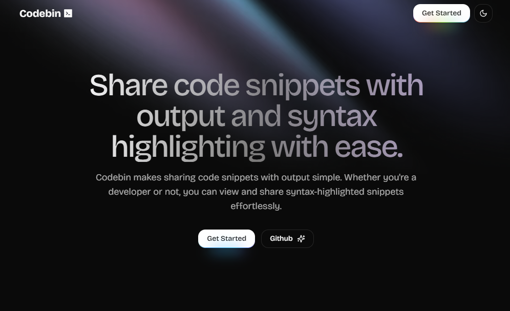

# Codebin

Codebin is a web application for storing and sharing code snippets. It allows users to create, edit, and delete code snippets, as well as share them with others via a unique URL.

## Tech Stack

- Frontend: Next.js, Tailwind CSS
- Backend: Firebase Realtime Database, Firebase Authentication
- Deployment: Vercel

# Currently In Development Phase